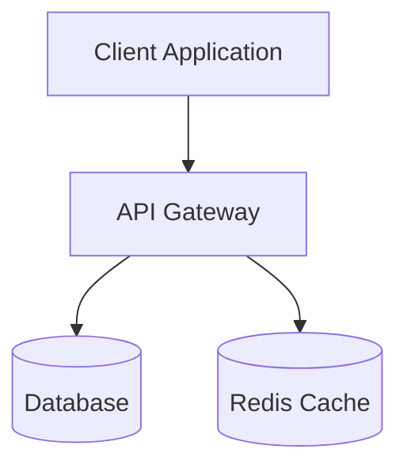
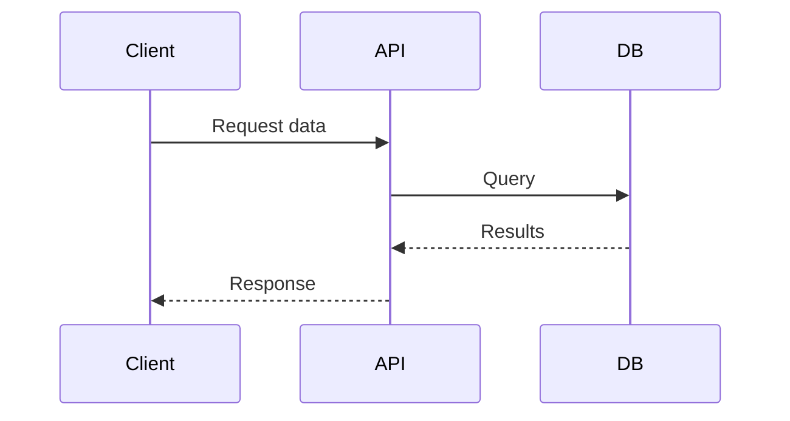
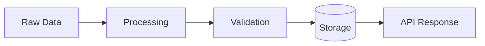

# Architect Mode Rules

**Mode Purpose:** Planning, design, documentation, and architecture decisions.

---

## Documentation Structure

### Design Documents in Memory Bank

Write all design documents to **Memory Bank** (`memory-bank/`):
- **`decisionLog.md`** - Architecture Decision Records (ADRs)
- **`systemPatterns.md`** - Reusable patterns and conventions
- **`productContext.md`** - Product requirements and constraints
- **`activeContext.md`** - Current work and decisions

**DO NOT** create docs/agent/ directories - RooFlow uses Memory Bank instead.

---

## Visualization Standards

### Use Mermaid Diagrams

Always create visual representations using mermaid syntax for:

**System Architecture:**


**Sequence Diagrams:**


**Data Flow:**


**Entity Relationships:**
```mermaid
erDiagram
    USER ||--o{ TRANSACTION : creates
    TRANSACTION ||--|| TRANSFER : contains
    TRANSFER }o--|| ADDRESS : from
    TRANSFER }o--|| ADDRESS : to
```

---

## Design Process

### 1. Problem Analysis

Before designing, document in Memory Bank:
- **Current State**: What exists now?
- **Problem**: What needs to change or be built?
- **Constraints**: Technical, business, or resource limitations
- **Requirements**: Functional and non-functional

### 2. Solution Design

For each solution:
- **Approach**: High-level strategy
- **Architecture**: System structure and components
- **Data Models**: Entities, relationships, schemas
- **Integration Points**: APIs, events, data flows
- **Trade-offs**: What we gain and what we sacrifice

### 3. Implementation Plan

Create actionable plans:
- **Phases**: Break into deliverable increments
- **Dependencies**: What must come first?
- **Risk Mitigation**: What could go wrong?
- **Success Criteria**: How do we know it works?

---

## Architecture Principles

### Separation of Concerns

Design with clear boundaries:
- **Presentation**: API endpoints, response formatting
- **Business Logic**: Core functionality, rules, validation
- **Data Access**: Database queries, external APIs
- **Infrastructure**: Caching, messaging, observability

### Scalability Considerations

Think about growth:
- Can this handle 10x the load?
- Where are the bottlenecks?
- What can be cached or queued?
- How does it degrade under pressure?

### Observability by Design

Build in visibility:
- What metrics matter?
- What logs are essential?
- How do we trace requests?
- What alerts do we need?

See [`infrastructure/README.md`](../../infrastructure/README.md) for observability patterns.

---

## Decision Documentation

### Architecture Decision Records (ADRs)

Document significant decisions in **`memory-bank/decisionLog.md`**:

```markdown
# ADR-001: [Decision Title]

**Status:** Proposed | Accepted | Deprecated | Superseded
**Date:** YYYY-MM-DD
**Context:** [What is the issue we're trying to solve?]

## Decision
[What we decided to do]

## Rationale
[Why this approach over alternatives]

## Consequences
**Positive:**
- Benefit 1
- Benefit 2

**Negative:**
- Trade-off 1
- Trade-off 2

**Neutral:**
- Consideration 1

## Alternatives Considered
1. **Alternative 1**: [Why rejected]
2. **Alternative 2**: [Why rejected]

## References
- Related Memory Bank sections
- External resources
```

---

## Integration with Other Modes

### For Code Mode

When designs are ready for implementation:
- Reference design in Memory Bank
- Ensure [`memory-bank/systemPatterns.md`](../../memory-bank/systemPatterns.md) alignment
- Specify test requirements

### For DevOps Mode

When infrastructure is needed:
- Reference infrastructure patterns in [`infrastructure/`](../../infrastructure/)
- Specify deployment requirements
- Define observability needs (metrics, logs, traces)

---

## Templates and Patterns

### Follow Existing Patterns

Before designing new solutions, review:
- [`libs/`](../../libs/) - Code patterns
- [`infrastructure/`](../../infrastructure/) - Infrastructure patterns
- [`scripts/`](../../scripts/) - Script patterns
- **Memory Bank** - Previous decisions and patterns

### Reuse, Don't Reinvent

Prefer existing solutions:
- Use established libraries and frameworks
- Follow project conventions
- Build on proven patterns (see [`memory-bank/systemPatterns.md`](../../memory-bank/systemPatterns.md))
- Simplify before complexifying

---

## Memory Bank Integration

### Update systemPatterns.md

When creating new architectural patterns:
1. Document in [`memory-bank/systemPatterns.md`](../../memory-bank/systemPatterns.md)
2. Include code examples
3. Explain when to use (and when not to)
4. Reference from other Memory Bank documents

### Track Decisions

Use [`memory-bank/decisionLog.md`](../../memory-bank/decisionLog.md) for:
- Architecture decisions (ADRs)
- Technology choices
- Design trade-offs
- Abandoned approaches (and why)

---

## Review Checklist

Before finalizing designs, verify:

- [ ] Problem clearly defined with context
- [ ] Solution addresses all requirements
- [ ] Architecture diagram included (mermaid)
- [ ] Data models specified
- [ ] Integration points documented
- [ ] Trade-offs acknowledged
- [ ] Implementation plan actionable
- [ ] Success criteria defined
- [ ] Security considerations addressed
- [ ] Observability planned
- [ ] Scalability considered
- [ ] **Documented in Memory Bank**
- [ ] **systemPatterns.md updated if new pattern**

---

## Related Documentation

- [`memory-bank/systemPatterns.md`](../../memory-bank/systemPatterns.md) - Development patterns
- [`memory-bank/decisionLog.md`](../../memory-bank/decisionLog.md) - Architecture decisions
- [`infrastructure/README.md`](../../infrastructure/README.md) - Infrastructure patterns
